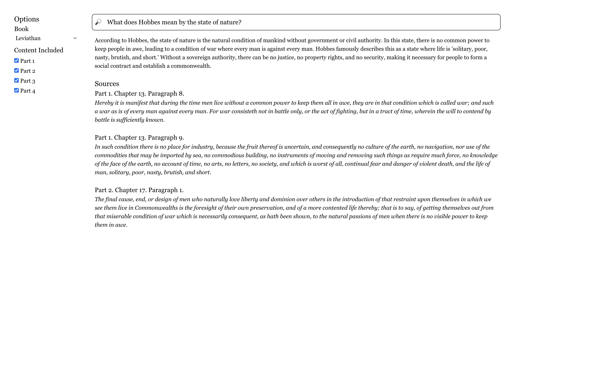

# Adam Smith - AI-Powered Classical Text Search

A semantic search application for exploring classical philosophical and economic texts using modern AI technology. Query *The Wealth of Nations* by Adam Smith and *The Leviathan* by Thomas Hobbes with natural language questions and receive intelligent, contextual answers with precise source citations.



## Features

- **Semantic Search**: Ask questions in natural language about complex philosophical concepts
- **AI-Powered Answers**: Get comprehensive explanations generated by OpenAI's language models
- **Source Citations**: Every answer includes exact references to specific chapters and paragraphs
- **Multi-Book Support**: Search across both *The Wealth of Nations* and *The Leviathan*
- **Selective Search**: Choose specific books/parts to focus your queries
- **Desktop Application**: Built as an Electron app for a native desktop experience

## Architecture

**Frontend**: React-based Electron desktop application with Tailwind CSS
- Clean, intuitive interface for querying classical texts
- Book and section selection controls
- Real-time search results with formatted source citations

**Backend**: Flask API server with AI integration
- OpenAI embeddings for semantic text analysis
- Pinecone vector database for fast similarity search
- Structured text processing with precise paragraph-level citations

## Quick Start

### Prerequisites
- Node.js and npm
- Python 3.x
- OpenAI API key
- Pinecone API key

### Environment Setup
```bash
export OPENAI_API_KEY="your-openai-key"
export PINECONE_API_KEY="your-pinecone-key"
```

### Frontend (Electron App)
```bash
cd frontend
npm install
npm run dev  # Starts both React and Electron
```

### Backend (Flask API)
```bash
cd backend
python server.py
```

## Usage

1. Launch the Electron application
2. Select a book (*Leviathan* or *The Wealth of Nations*)
3. Choose which parts/books to include in your search
4. Ask a question about philosophical or economic concepts
5. Receive AI-generated answers with precise source citations

### Example Queries
- "What does Hobbes mean by the state of nature?"
- "How does Adam Smith explain the division of labor?"
- "What is the relationship between liberty and security in Leviathan?"
- "What causes the wealth of nations according to Smith?"

## Technology Stack

- **Frontend**: React 18, Electron, Tailwind CSS
- **Backend**: Flask, OpenAI API, Pinecone Vector Database
- **Text Processing**: Custom book parsing with Roman numeral handling
- **AI**: OpenAI embeddings and GPT models for semantic search and answer generation

## Project Structure

```
adam_smith/
├── frontend/           # React + Electron desktop app
│   ├── src/           # React components and logic
│   └── public/        # Electron main process
├── backend/           # Flask API server
│   ├── books/         # Text processing classes
│   ├── dumps/         # Preprocessed text data
│   └── server.py      # Main API endpoint
└── README.md
```

## Inspiration

This project was inspired by my experience taking the Social Science Core (SOSC) at UChicago. The course was amazing. We got to read foundational texts and I built Adam to be the study tool I wish I had.
